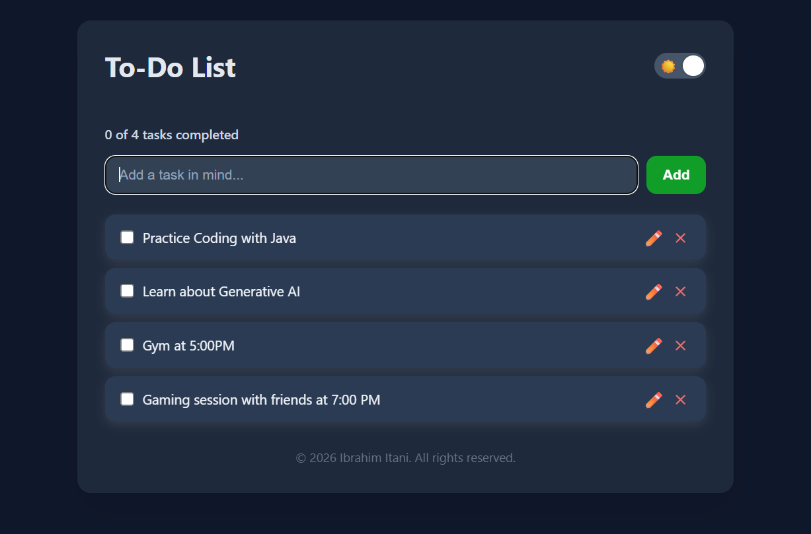

# 📝 GoodSheets-Inspired To-Do List

A modern, responsive **To-Do List web application** inspired by spreadsheet-style task management.  
Users can **add, edit, complete, and delete tasks**, with **bulk deletion**, **dark mode**, and **persistent local storage**.

---

## 🚀 Features

- **Add, Edit, and Delete Tasks** – Inline editing with ✏️ icon and single-task deletion with ✕ button.
- **Mark Tasks as Completed** – Click on a task to toggle completion status.
- **Bulk Delete** – Select multiple tasks using checkboxes and delete them all at once.
- **Persistent Local Storage** – Tasks are saved in the browser and persist across page reloads.
- **Dark Mode Toggle** – Switch between light and dark themes. Preference saved automatically.
- **Task Tracker** – Shows completed tasks out of total tasks.
- **Responsive Design** – Works on mobile, tablet, and desktop.
- **Tooltips & Tips** – Guides users on bulk deletion functionality.

---

## Screenshots

---

## 💻 Technologies Used

- **HTML5** – Semantic markup  
- **CSS3 / Flexbox / CSS Variables** – Responsive styling and dark mode  
- **JavaScript (Vanilla)** – DOM manipulation, event handling, local storage  
- **Animations** – Smooth transitions for tasks and tooltips

---